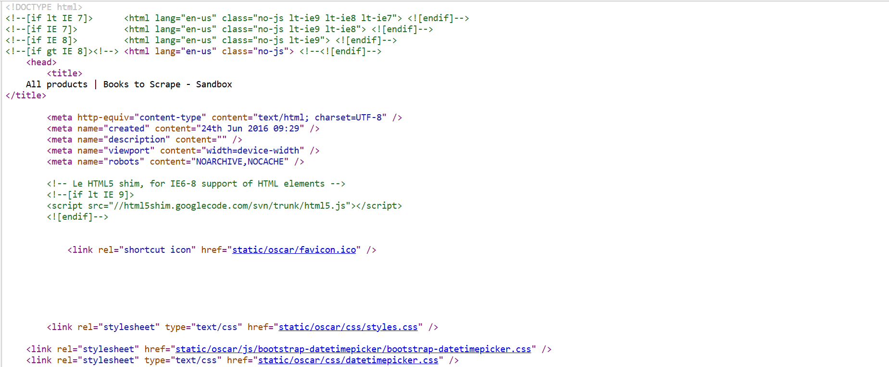
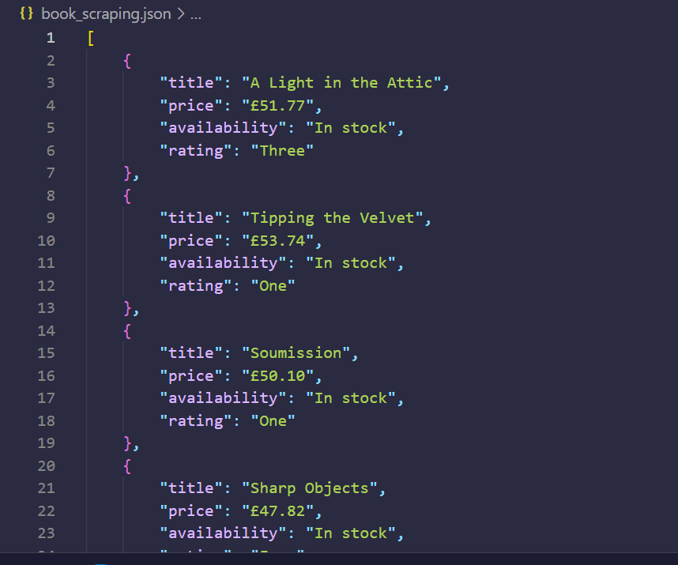
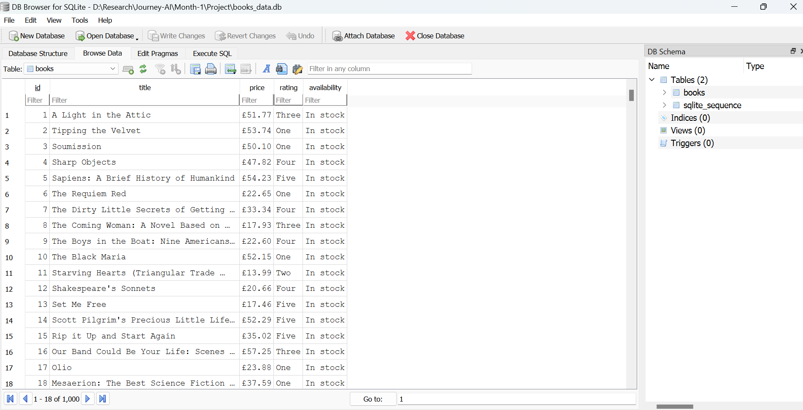

# 📚 Book Scraper

A Python web scraping project that extracts book information from [Books to Scrape](http://books.toscrape.com) — a public sandbox site designed for learning.  
The project collects book titles, prices, availability, and star ratings from 50 pages and stores the data in both **JSON** and **SQLite** formats.

---

## 🔧 Technologies Used

- Python 3
- BeautifulSoup (bs4)
- Requests / urllib
- JSON
- SQLite3
- Pandas (optional for enhancements)

---

## 🚀 What This Project Does

✅ Scrapes:
- Book title
- Price
- Availability
- Star rating (e.g., One, Two, Three...)

✅ Saves data to:
- `book_scraping.json` – human-readable JSON
- `books_data.db` – structured SQLite database

---

## 🔄 Before vs After

This project transforms raw, unstructured HTML into clean, usable data stored in JSON and SQLite.

### 🧪 Raw HTML (Before scraping)


```html
<article class="product_pod">
  <div class="image_container">
    <a href="catalogue/a-light-in-the-attic_1000/index.html">
      
    </a>
  </div>
  <p class="star-rating Three">
    <i class="icon-star"></i>
    ...
  </p>
  <h3>
    <a href="catalogue/a-light-in-the-attic_1000/index.html" title="A Light in the Attic">
      A Light in the ...
    </a>
  </h3>
  <div class="product_price">...</div>
</article>
````

### ✅ Structured Output (After scraping)



```json
{
  "title": "The Grand Design",
  "price": "£13.76",
  "availability": "In stock",
  "rating": "Five"
}
```

---

## 📄 Field Descriptions

| Field          | Description                                                     |
| -------------- | --------------------------------------------------------------- |
| `title`        | Book title (from the `title` attribute in `<a>` inside `<h3>`)  |
| `price`        | Price in GBP (e.g., £13.76)                                     |
| `availability` | Availability status (e.g., "In stock")                          |
| `rating`       | Star rating as text ("One" to "Five") extracted from class name |

---

## 🖼 SQLite Output Screenshot



---

## 📁 Project Structure

```
book-scraper/
├── main.py             # Full scraping + SQLite pipeline
├── book_scraping.json  # JSON output of scraped data
├── books_data.db       # SQLite DB storing the same data
├── README.md           # You're here!
└── /screenshots/       # (Optional) Screenshot images
```


📁 Output:

* A `book_scraping.json` file with structured data
* A `books_data.db` SQLite database with a `books` table

---

## 🧾 Example JSON Output

```json
{
  "title": "The Grand Design",
  "price": "£13.76",
  "availability": "In stock",
  "rating": "Five"
}
```

---

## 🌱 What I Will Add Next (Future Enhancements)

* 📊 Visualize data using **Matplotlib** or **Seaborn**
* 🌐 Build a mini **Streamlit dashboard** for filtering and searching
* 🔍 Add filters (e.g., books under £20, 5-star rated only)
* 🧠 Add command-line search options (search by title, rating)
* 📤 Export SQLite data to CSV

---

## 📎 License

This project is for **educational purposes only**, built on top of a public sandbox site ([http://books.toscrape.com](http://books.toscrape.com)) provided for learning and testing.

